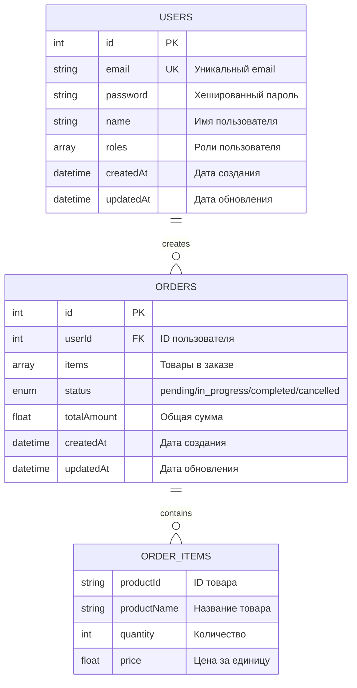

# Micro Task Template - Микросервисная архитектура

Современная микросервисная архитектура для управления пользователями и заказами, построенная на Node.js с использованием Docker.

## 🏗️ Архитектура

Система состоит из трех основных компонентов:
- **API Gateway** - центральная точка входа с аутентификацией и маршрутизацией
- **Users Service** - микросервис для управления пользователями
- **Orders Service** - микросервис для управления заказами

## 📊 ERD Диаграмма



## 📁 Структура проекта

```
micro-task-template/
├── api_gateway/                # API Gateway сервис
│   ├── index.js               # Основной файл с маршрутизацией
│   ├── package.json           # Зависимости API Gateway
│   └── Dockerfile             # Docker конфигурация
├── service_users/             # Микросервис пользователей
│   ├── index.js               # Логика управления пользователями
│   ├── package.json           # Зависимости Users Service
│   └── Dockerfile             # Docker конфигурация
├── service_orders/            # Микросервис заказов
│   ├── index.js               # Логика управления заказами
│   ├── package.json           # Зависимости Orders Service
│   └── Dockerfile             # Docker конфигурация
├── docker-compose.yml         # Orchestration всех сервисов
├── postman_collection.json    # Полная коллекция API тестов
├── postman_environment.json   # Переменные окружения для тестов
├── wsl-docker-install.md      # Инструкция по установке Docker в WSL
└── readme.md                  # Документация проекта
```

## 🛠️ Технологический стек

### API Gateway
- **Express.js** `^4.18.2` - веб-фреймворк
- **opossum** `^7.0.0` - circuit breaker pattern
- **jsonwebtoken** `^9.0.2` - JWT аутентификация
- **axios** `^1.5.0` - HTTP клиент для межсервисного взаимодействия
- **express-rate-limit** `^7.1.5` - rate limiting
- **swagger-ui-express** `^5.0.0` - API документация
- **swagger-jsdoc** `^6.2.8` - генерация Swagger схем
- **pino** `^8.15.0` - логирование
- **cors** `^2.8.5` - CORS поддержка

### Users Service
- **Express.js** `^4.18.2` - веб-фреймворк
- **jsonwebtoken** `^9.0.2` - JWT токены
- **zod** `^3.22.4` - валидация данных
- **cors** `^2.8.5` - CORS поддержка

### Orders Service
- **Express.js** `^4.18.2` - веб-фреймворк
- **zod** `^3.22.4` - валидация данных
- **cors** `^2.8.5` - CORS поддержка

### DevOps
- **Docker** - контейнеризация сервисов
- **Docker Compose** - orchestration
- **nodemon** `^3.0.1` - hot reload для разработки

## 🔑 Ролевая модель

Система поддерживает 4 роли пользователей:

| Роль | Описание | Доступ |
|------|----------|--------|
| **Customer** | Клиент | Создание заказов, просмотр своих заказов |
| **Engineer** | Инженер | Просмотр всех заказов, изменение статуса заказов |
| **Manager** | Менеджер | Все права Engineer + управление пользователями, отмена заказов |
| **Admin** | Администратор | Полный доступ ко всем функциям системы |

## 🗃️ Базовые пользователи

Система автоматически создает тестовых пользователей при запуске:

| Email | Пароль | Роль |
|-------|---------|------|
| customer@example.com | password123 | Customer |
| engineer@example.com | password123 | Engineer |
| manager@example.com | password123 | Manager |
| admin@example.com | password123 | Admin |

## 🚀 Быстрый старт

### Требования
- Docker Desktop
- Docker Compose
- Git

### Установка и запуск

1. **Клонирование репозитория**
```bash
git clone https://github.com/EbatteSratte/micro-task-template.git
cd micro-task-template
```

2. **Запуск всех сервисов**
```bash
docker-compose up -d
```

3. **Проверка статуса сервисов**
```bash
docker-compose ps
```

### Доступные порты
- **API Gateway**: http://localhost:8000
- **Users Service**: http://localhost:8001
- **Orders Service**: http://localhost:8002
- **API Documentation**: http://localhost:8000/api-docs

## 📡 API Endpoints

### Аутентификация
- `POST /api/v1/users/register` - Регистрация пользователя
- `POST /api/v1/users/login` - Вход в систему

### Пользователи
- `GET /api/v1/users/profile` - Получить свой профиль
- `PUT /api/v1/users/profile` - Обновить свой профиль
- `GET /api/v1/users` - Получить всех пользователей (Manager+)
- `POST /api/v1/users` - Создать пользователя (Admin)
- `GET /api/v1/users/:id` - Получить пользователя по ID (Manager+)
- `PUT /api/v1/users/:id` - Обновить пользователя (Admin)
- `DELETE /api/v1/users/:id` - Удалить пользователя (Admin)

### Заказы
- `POST /api/v1/orders` - Создать заказ (Customer+)
- `GET /api/v1/orders/my` - Мои заказы (Customer+)
- `GET /api/v1/orders` - Все заказы (Engineer+)
- `GET /api/v1/orders/:id` - Заказ по ID (Engineer+)
- `PATCH /api/v1/orders/:id/status` - Обновить статус (Engineer+)
- `PATCH /api/v1/orders/:id/cancel` - Отменить заказ (Manager+)
- `PUT /api/v1/orders/:id` - Обновить заказ (Manager+)

### Система
- `GET /api/v1/health` - Общий health check
- `GET /api/v1/status` - Статус API Gateway
- `GET /api/v1/users/health` - Статус Users Service
- `GET /api/v1/orders/health` - Статус Orders Service

## 🧪 Тестирование

### Postman коллекция
В проекте включена полная коллекция Postman с 25+ тестовыми сценариями:

1. **Импорт коллекции**
   - `postman_collection.json` - основная коллекция
   - `postman_environment.json` - переменные окружения

2. **Запуск тестов**
   - Сначала выполните аутентификацию для получения токенов
   - Токены автоматически сохраняются в переменные
   - Запускайте остальные тесты согласно ролевой модели

### Тестовые сценарии
- ✅ Аутентификация и авторизация
- ✅ CRUD операции с пользователями
- ✅ CRUD операции с заказами
- ✅ Проверка ролевых ограничений
- ✅ Health checks всех сервисов
- ✅ Валидация ошибок и статусов ответов

## 🏥 Мониторинг и отказоустойчивость

### Circuit Breaker Pattern
API Gateway использует **opossum** для реализации circuit breaker паттерна:
- Таймаут запросов: 3 секунды
- Порог ошибок: 50%
- Время восстановления: 30 секунд

### Логирование
Структурированное логирование с помощью **pino**:
- JSON формат логов
- Разные уровни логирования
- Красивый вывод в development режиме

### Rate Limiting
Ограничение частоты запросов для критичных эндпоинтов:
- Аутентификация: максимум 5 попыток в 15 минут
- Общие запросы: настраиваемые лимиты

## 🔒 Безопасность

- **JWT токены** для аутентификации
- **Ролевая авторизация** с middleware проверками
- **CORS** настройки для безопасности
- **Rate limiting** против брутфорса
- **Валидация входных данных** с помощью Zod

## 🐳 Docker конфигурация

Каждый сервис имеет оптимизированный Dockerfile:
- Multi-stage builds для минимизации размера образов
- Non-root пользователи для безопасности
- Health checks для мониторинга состояния
- Оптимизированная установка зависимостей